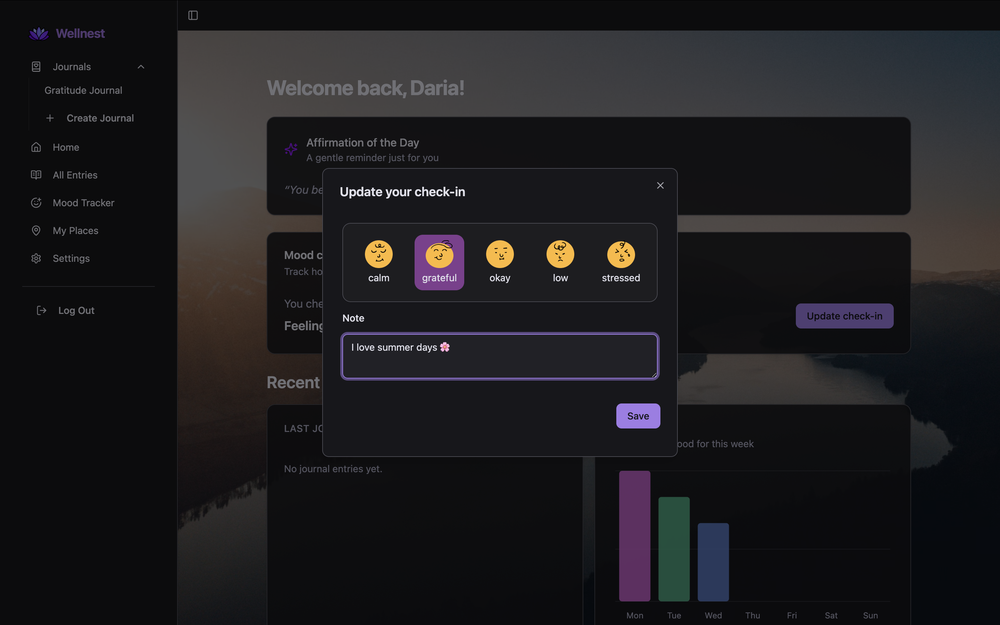

## 🌿 🧘 Wellnest

Wellnest is a mindfulness and journaling web app, inspired by [Day One](https://dayoneapp.com/) and [Insight Timer](https://insighttimer.com/).

This repository contains frontend part of the application.

### 🔗 Link to the backend repo
You can check out the backend repo [here](https://github.com/DarjaElina/wellnest-backend)

### ✨ Features
- Rich journaling experience using [TipTap](https://tiptap.dev/) editor
- Mood tracking with daily check-ins
- Daily affirmations from your preferred set
- Personalization options: wallpapers, themes, and emoji mood sets
- See your weekly mood data with charts
- Export journal entries as PDFs

### 🌐 Live Demo

You can try the app [here](https://wellnest.delina.me/) ✨

Feel free to use the demo mode without creating an account 🌸

If you do choose to register, please notice the backend is deployed on Render and might take some time to start 😅

### 💡 About the Project

I originally started this project as a medical app for tracking symptoms and collecting health data (you can still see that from the commit history). But as the app grew, I became more and more interested in creating something for mental health and mindfulness, so that’s how Wellnest turned into what it is now 😁
I found a wonderful app called [Day One](https://dayoneapp.com/), which I used a lot for inspiration. While building this, I discovered some new tools and ideas — like how **indexed databases** work for offline-first apps.

### Tech Stack
- **Core:** [TypeScript](https://www.typescriptlang.org/), [React](https://react.dev/), [Vite](https://vite.dev/)
- **Styling:** [Tailwind CSS](https://tailwindcss.com/), [shadcn/ui](https://ui.shadcn.com/)
- **Forms:** [React Hook Form](https://react-hook-form.com/), [Zod](https://zod.dev/)
- **State Management:** [TanStack Query](https://tanstack.com/query/), [Redux](https://redux.js.org/)
- **Routing:** [React Router](https://reactrouter.com/)
- **Maps:** [React Leaflet](https://react-leaflet.js.org/)
- **Indexed DB:** [Dexie.js](https://dexie.org/)
- **Animations:** [Motion](https://motion.dev/)
- **Testing:** [Vitest](https://vitest.dev/), [MSW](https://mswjs.io/), [React Testing Library](https://testing-library.com/)
- **Code Quality:** [ESLint](https://eslint.org/)
- **Icons:** [Lucide-react](https://lucide.dev/guide/packages/lucide-react)
- **Auth:** Google Authentication with OAuth2
- **Delpoyment:** [Vercel](https://vercel.com/)

### 🖼️ Screenshots

#### Dashboard

---

#### Daily Mood Check-in

---

#### Create Journal

---

#### Create Place

---

#### Entry Editor

### Thank you for checking out Wellnest 🌸💙

