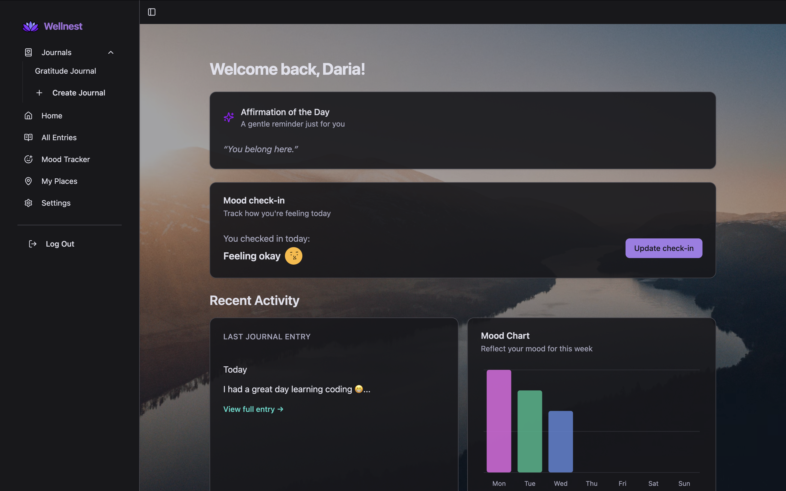
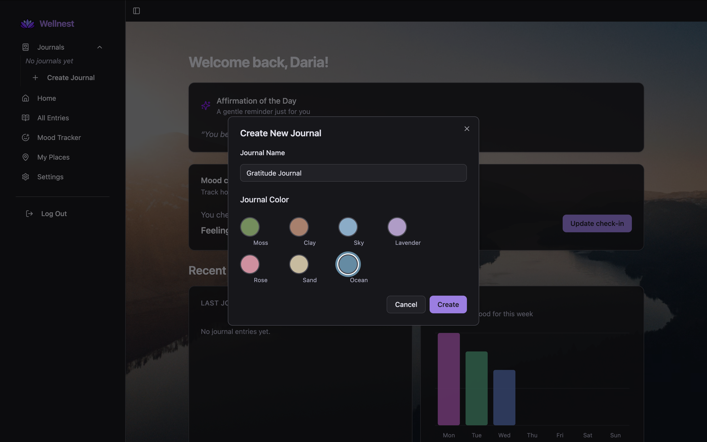
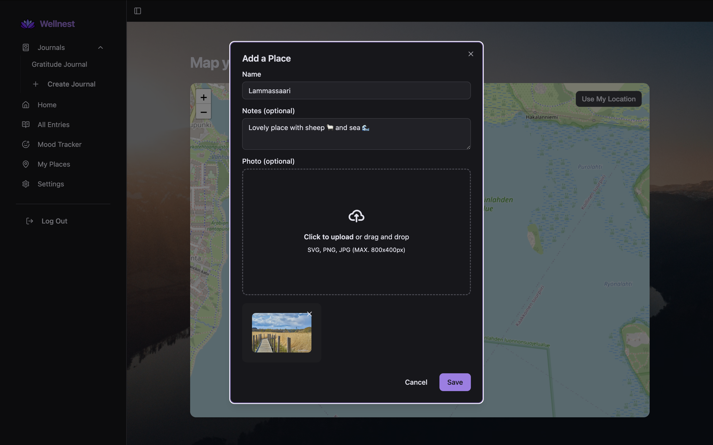
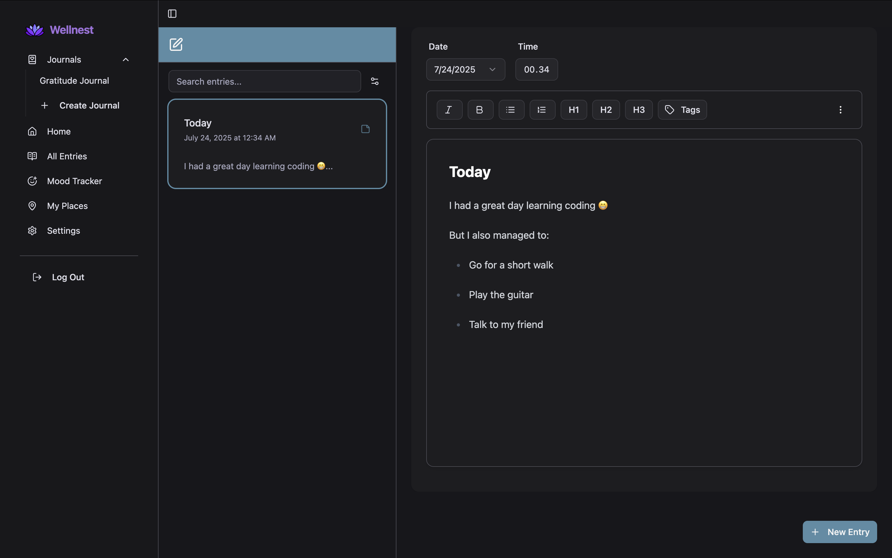

## 🌿 🧘 Wellnest

Wellnest is a mindfulness and journaling web app, inspired by [Day One](https://dayoneapp.com/) and [Insight Timer](https://insighttimer.com/).

This repository contains frontend part of the application.

### 🔗 Link to the backend repo
You can check the backend repo [here](https://github.com/DarjaElina/wellnest-backend)

### ✨ Features
- Rich journaling experience using [TipTap](https://tiptap.dev/) editor
- Mood tracking with daily check-ins
- Daily affirmations from your preferred set
- Personalization options: wallpapers, themes, and emoji mood sets
- Save your favorite places on a map, complete with pictures
- Export journal entries as PDFs
- Set daily reminders to track your mood via customizable popups

### 💡 About the Project

I originally started building Wellnest as a medical journaling app to help users track symptoms and health data. But as the project evolved, I felt more drawn to creating a space that supports mental wellbeing and mindfulness. It gradually transformed into a softer, more personal tool — a calm, responsive, and user-friendly space where people can reflect, feel grounded, and track their emotional journey. Along the way, I deepened my skills as a full-stack developer and explored how technology can support emotional health in thoughtful, accessible ways.

### 🌐 Live Demo

You can try the app [here](https://wellnest.delina.me/) ✨

> Want to explore quickly? Use the demo mode to try journaling without registering!

### Tech Stack
- **Core:** [TypeScript](https://www.typescriptlang.org/), [React](https://react.dev/), [Vite](https://vite.dev/)
- **Styling:** [Tailwind CSS](https://tailwindcss.com/), [shadcn/ui](https://ui.shadcn.com/)
- **Forms:** [React Hook Form](https://react-hook-form.com/), [Zod](https://zod.dev/)
- **State Management:** [TanStack Query](https://tanstack.com/query/), [Redux](https://redux.js.org/)
- **Routing:** [React Router](https://reactrouter.com/)
- **Maps:** [React Leaflet](https://react-leaflet.js.org/)
- **Offline DB:** [Dexie.js](https://dexie.org/)
- **Animations:** [Motion](https://motion.dev/)
- **Testing:** [Vitest](https://vitest.dev/), [MSW](https://mswjs.io/), [React Testing Library](https://testing-library.com/)
- **Code Quality:** [ESLint](https://eslint.org/)
- **Icons:** [Lucide-react](https://lucide.dev/guide/packages/lucide-react)
- **Auth:** Google Authentication with OAuth2
- **Delpoyment:** [Vercel](https://vercel.com/)

### 🖼️ Screenshots

### Screenshots

#### Dashboard

---

#### Create Journal

---

#### Create Place

---

#### Entry Editor

### Thank you for checking out Wellnest 🌸💙

